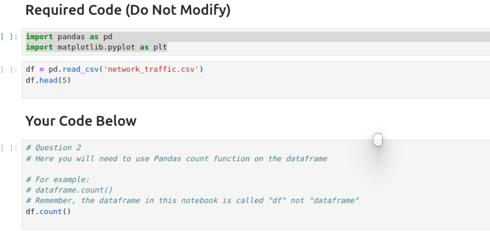
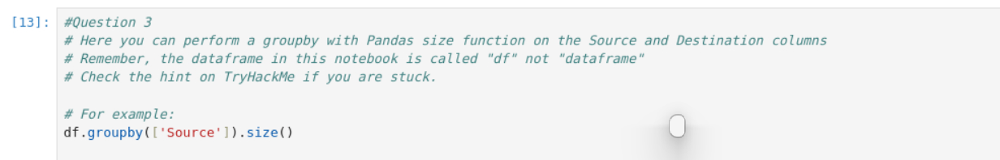
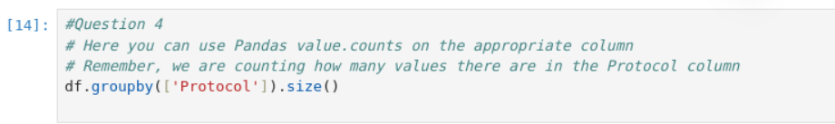

# Task 8 [Day 2] Log analysis: O Data, All Ye Faithful
# The Story


## *Answer Of The Question Below*

#### How many packets were captured (looking at the PacketNumber)?

###### df.count()
.png)
```python
100
```
#### What IP address sent the most amount of traffic during the packet capture?

###### df.groupby(['Source']).size()
.png)
```python
10.10.1.4
```
#### What was the most frequent protocol?

###### df.groupby(['Protocol']).size()
.png)
```python
ICMP
```
