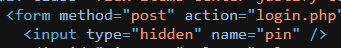

# Task 9 [Day 3] Brute-forcing: Hydra is Coming to Town
# The Story


## *Answer Of The Question Below*

#### Using crunch and hydra, find the PIN code to access the control system and unlock the door. What is the flag?

```html

<!DOCTYPE html>
<html lang="en">

<head>
  <meta charset="UTF-8" />
  <meta name="viewport" content="width=device-width, initial-scale=1.0" />
  <meta name="description" content="TryHackMe is a free online platform for learning cyber security, using hands-on exercises and labs, all through your browser!" />
  <meta name="og:description" content="TryHackMe is a free online platform for learning cyber security, using hands-on exercises and labs, all through your browser!" />
  <meta name="keywords" content="cyber,security,cyber security,cyber security training" />
  <meta name="viewport" content="width=device-width,initial-scale=1.0" />

  <meta property="og:site_name" content="TryHackMe" />
  <meta property="og:title" content="TryHackMe | Cyber Security Training" />
  <meta property="og:image" content="https://tryhackme.com/img/meta/default.png" />
  <meta property="og:url" content="https://tryhackme.com" />
  <meta name="twitter:image" content="https://tryhackme.com/img/meta/default.png" />
  <meta property="og:description" content="An online platform for learning and teaching cyber security, all through your browser." />
  <link rel="icon" type="image/png" href="https://assets.tryhackme.com/img/favicon.png" />

  <title>Hack the Server Door | TryHackMe</title>
  <link rel="stylesheet" href="./styles.css">
</head>

<body class="bg-thm text-white">
  <div class="flex items-center justify-center min-h-screen w-full max-w-xl mx-auto">
    <form method="post" action="login.php" class="grid grid-cols-3 max-w-lg mx-auto bg-thm-900 p-4 font-mono">
      <input type="hidden" name="pin" />
      <div id="pin-text" class="col-span-4 h-20 flex items-center justify-center bg-gray-900 border-2 border-gray-800 text-green w-full text-5xl tabular-nums py-2 px-2 text-center tracking-[1rem] indent-4"></div>
      <button type="button" class="cursor-pointer bg-thm border border-thm-900 h-20 tabular-nums text-gray-400 hover:bg-gray-900 hover:text-white col-span-1 w-20 text-3xl" data-pin="0">0</button><button type="button" class="cursor-pointer bg-thm border border-thm-900 h-20 tabular-nums text-gray-400 hover:bg-gray-900 hover:text-white col-span-1 w-20 text-3xl" data-pin="1">1</button><button type="button" class="cursor-pointer bg-thm border border-thm-900 h-20 tabular-nums text-gray-400 hover:bg-gray-900 hover:text-white col-span-1 w-20 text-3xl" data-pin="2">2</button><button type="button" class="cursor-pointer bg-thm border border-thm-900 h-20 tabular-nums text-gray-400 hover:bg-gray-900 hover:text-white col-span-1 w-20 text-3xl" data-pin="3">3</button><button type="button" class="cursor-pointer bg-thm border border-thm-900 h-20 tabular-nums text-gray-400 hover:bg-gray-900 hover:text-white col-span-1 w-20 text-3xl" data-pin="4">4</button><button type="button" class="cursor-pointer bg-thm border border-thm-900 h-20 tabular-nums text-gray-400 hover:bg-gray-900 hover:text-white col-span-1 w-20 text-3xl" data-pin="5">5</button><button type="button" class="cursor-pointer bg-thm border border-thm-900 h-20 tabular-nums text-gray-400 hover:bg-gray-900 hover:text-white col-span-1 w-20 text-3xl" data-pin="6">6</button><button type="button" class="cursor-pointer bg-thm border border-thm-900 h-20 tabular-nums text-gray-400 hover:bg-gray-900 hover:text-white col-span-1 w-20 text-3xl" data-pin="7">7</button><button type="button" class="cursor-pointer bg-thm border border-thm-900 h-20 tabular-nums text-gray-400 hover:bg-gray-900 hover:text-white col-span-1 w-20 text-3xl" data-pin="8">8</button><button type="button" class="cursor-pointer bg-thm border border-thm-900 h-20 tabular-nums text-gray-400 hover:bg-gray-900 hover:text-white col-span-1 w-20 text-3xl" data-pin="9">9</button><button type="button" class="cursor-pointer bg-thm border border-thm-900 h-20 tabular-nums text-gray-400 hover:bg-gray-900 hover:text-white col-span-1 w-20 text-3xl" data-pin="A">A</button><button type="button" class="cursor-pointer bg-thm border border-thm-900 h-20 tabular-nums text-gray-400 hover:bg-gray-900 hover:text-white col-span-1 w-20 text-3xl" data-pin="B">B</button><button type="button" class="cursor-pointer bg-thm border border-thm-900 h-20 tabular-nums text-gray-400 hover:bg-gray-900 hover:text-white col-span-1 w-20 text-3xl" data-pin="C">C</button><button type="button" class="cursor-pointer bg-thm border border-thm-900 h-20 tabular-nums text-gray-400 hover:bg-gray-900 hover:text-white col-span-1 w-20 text-3xl" data-pin="D">D</button><button type="button" class="cursor-pointer bg-thm border border-thm-900 h-20 tabular-nums text-gray-400 hover:bg-gray-900 hover:text-white col-span-1 w-20 text-3xl" data-pin="E">E</button><button type="button" class="cursor-pointer bg-thm border border-thm-900 h-20 tabular-nums text-gray-400 hover:bg-gray-900 hover:text-white col-span-1 w-20 text-3xl" data-pin="F">F</button>      <button class="cursor-pointer bg-thm border border-thm-900 h-20 tabular-nums text-gray-400 hover:bg-gray-900 hover:text-white col-span-2 w-full mt-1 text-lg uppercase tracking-widest" type="button" data-pin="<">Backspace</button>
      <input class="cursor-pointer bg-thm border border-thm-900 h-20 tabular-nums text-gray-400 hover:bg-gray-900 hover:text-white col-span-2 w-full mt-1 text-lg uppercase tracking-widest" type="submit" value="Continue" />
    </form>
  </div>
  <script type="text/javascript">
    const PIN_LENGTH = 3;
    document.querySelectorAll('button[data-pin]').forEach((button) => {
      button.addEventListener('click', () => {
        const pin = button.getAttribute('data-pin');
        const pinInput = document.querySelector('input[name="pin"]')
        if (pin === '<') {
          // remove the last character
          pinInput.value = pinInput.value.substring(0, pinInput.value.length - 1);
        } else if (pinInput.value.length < PIN_LENGTH) {
          pinInput.value += pin;
        }
        document.querySelector('#pin-text').innerText = document.querySelector('input').value;
      })
    });;
  </script>
</body>


</html>
```

